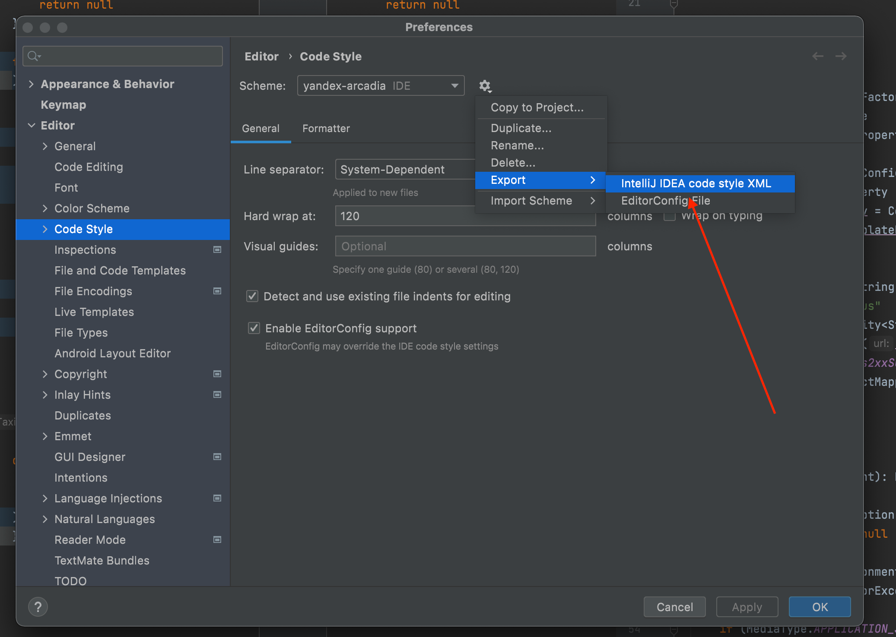

# Специальные вычислительный практикум (шаблон проекта)

## Автоформатирование
1. Переходим в ```Intelij IDEA -> Preferences -> Code style```:

2. Указываем файл ```spbu_apcyb.xml```

3. Также важно не забывать запускать автоформатирование. Его можно настроить на определенные клавиши (например, option + command + L):
4. Настраиваем импорты:
   - Переходим в ```File => Settings... => Editor => Code Style => Java => Imports```
   - Не используем импорты с *:
     ```
     Class count to use import with '*': 999
     Names count to use static import with '*': 999
     ```
   - Поле ```Packages to use imports with '*'```  должно быть пустым
   - ```import layout``` должен быть таким:
   ```
     import java.*
     <blank line>
     import javax.*
     <blank line>
     import all other imports
     <blank line>
     import yandex.*
     import ru.yandex.*
     <blank line>
     import static all other imports
   ```


## Настройка checkstyle
Откройте ```Preferences => Plugins => "Check style"```
Установить ```CheckStyle-IDEA```


## Настройка SonarLint
Откройте и установите ```Preferences => Plugins => "SonarLint"```

Будем использовать стандартные настройки без выгрузки конфигураций в Cloud

Выставите настройки как на картинке:
