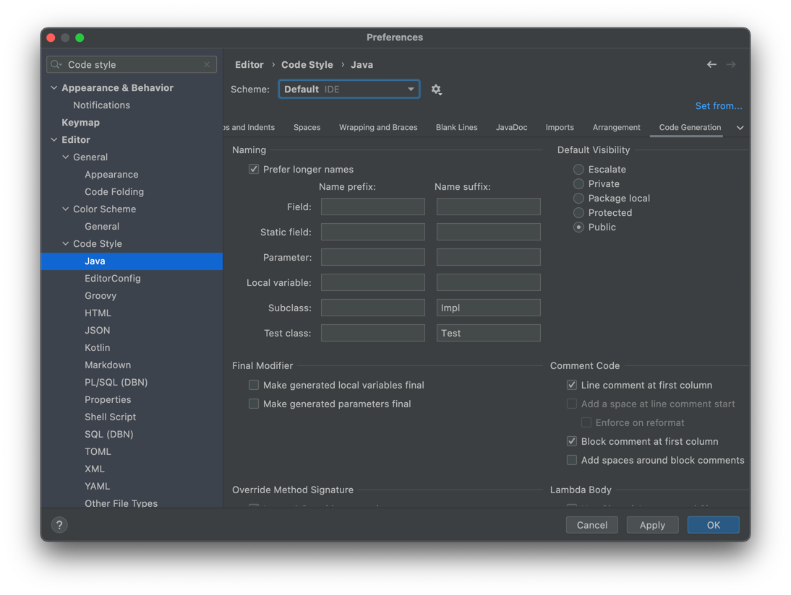
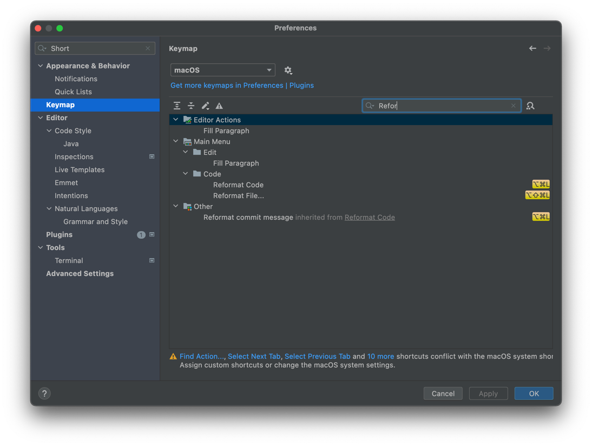
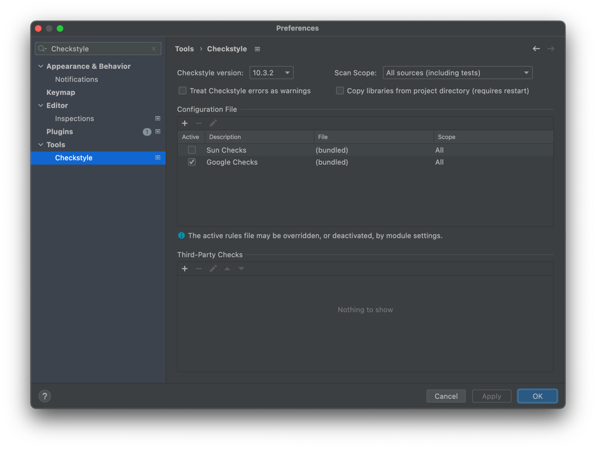
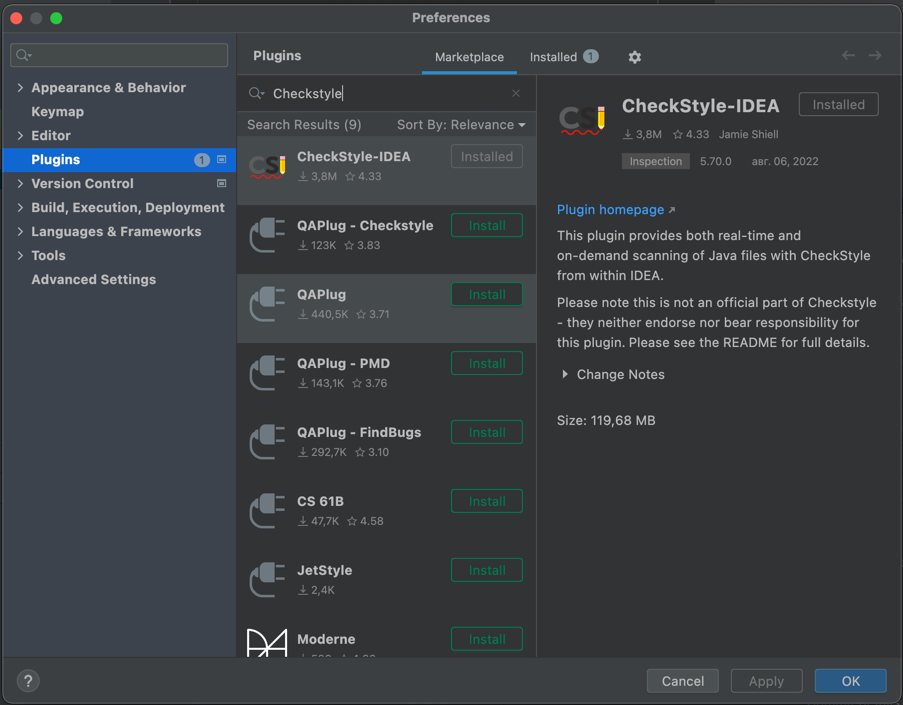
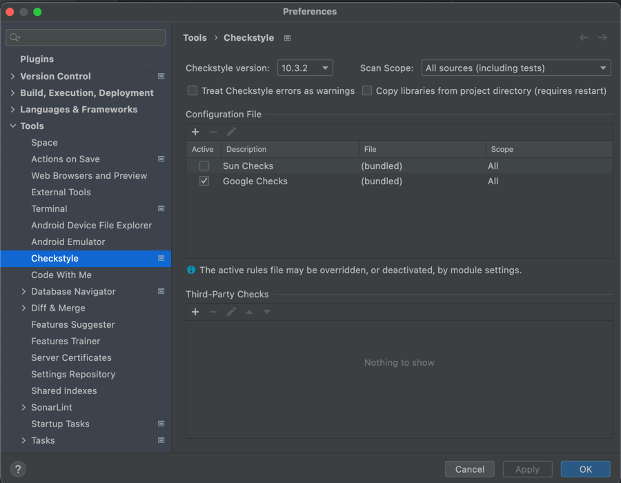

[](https://sonarcloud.io/summary/new_code?id=bas-kirill_special-computing-workshop-template)
[](https://opensource.org/licenses/MIT)

# Специальный вычислительный практикум (шаблон проекта)

## Автоформатирование
1. Переходим в ```Intelij IDEA => Preferences => Code style```
2. Импортируем из корня проекта ```google_codestyle.xml```

3. Также важно не забывать запускать автоформатирование. Его можно настроить на определенные клавиши (например, option + command + L):


## Настройка Checkstyle
Установите ```Preferences => Plugins => "CheckStyle-IDEA"```

Выставите настройки как на скрине:


## Настройка SonarLint
Установите ```Preferences => Plugins => "SonarLint"```

## Настройка SonarQube
Переходим в ```Preferences => Tools => SonarLint => Project Settings```


Переходим в ```Configure the connection...``` и добавляем ```SonarQube / SonarCloud connections```:


Нажимаем на ```Connect to the online service``` и регистрируемся под GitHub профилем.

В результате должна открыться страница с проверкой кода:


После этого переходим ```Next``` во вкладке нового подключения и генерируем токен:


Прокликиваем ```Next```. в результате должно быть установлено соединение в ```Tools => SonarLint```:


Добавляем соединение:


## Запуск JoCoCo
При запуске проверьте, что в конфигурации запуска указаны следующие настройки в ```code coverage```:


Ожидаемый результат:

